# Diseño Mecánico

## Estructura general del sistema

La estructura física de **Planchado Express** está compuesta por una **banda transportadora lineal** con tres estaciones de sensado y una plataforma de montaje para el robot UR3. El recorrido de la prenda va desde la entrada (sensor S1) hasta la salida por gancho (sensor S3).

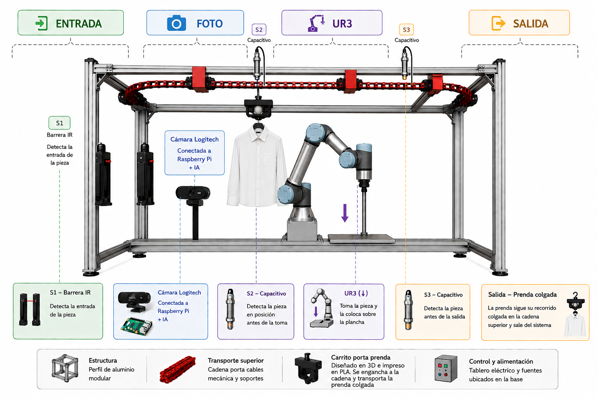
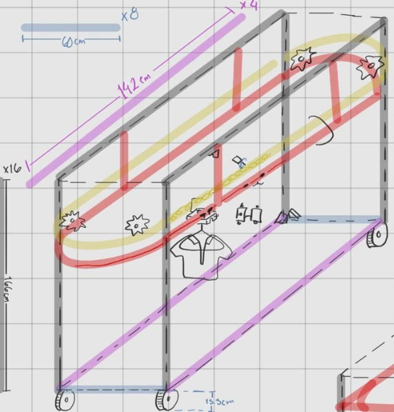

---

## Robot UR3 — Especificaciones físicas

| Parámetro | Valor |
| :--- | :--- |
| Modelo | Universal Robots UR3 |
| Tipo | Robot colaborativo (Cobot) |
| Grados de libertad | 6 DOF |
| TCP configurado | `p[0.0, 0.0, 0.0777, 0.0, 0.0, 0.0]` |
| Payload configurado | 0.1 kg |
| Voltaje de herramienta | 24 V |
| Gravedad configurada | `[0.0, 0.0, 9.82]` m/s² |
| Efector final | Agarrador impreso en PLA (fabricación propia) |
| Herramienta montada | Plancha eléctrica comercial |
| Waypoints por rutina | 7 puntos calibrados |

---

## Efector final — Agarrador PLA

El agarrador del efector final fue **diseñado y fabricado mediante impresión 3D** en filamento PLA. Está dimensionado para:

- Sostener con seguridad la plancha comercial utilizada.
- Garantizar la geometría de contacto correcta con la superficie de la prenda durante las trayectorias de planchado.
- Resistir el peso y el calor transmitido por la plancha durante la operación continua.

---

## Banda transportadora

| Parámetro | Descripción |
| :--- | :--- |
| Tipo | Banda lineal motorizada |
| Dirección | Unidireccional (adelante) |
| Control | PLC Micro850 (coils `000001`, `000002`, `000003`) |
| Estaciones | Entrada → Foto → UR3 → Salida |
| Mecanismo de salida | Pistón eléctrico + gancho lateral |

---

## Actuador de salida — Pistón eléctrico

El pistón eléctrico está controlado por el **ESP32** mediante comandos seriales desde la Raspberry Pi. Al activarse, empuja lateralmente la prenda planchada hacia el gancho de salida donde el cliente la recoge.

| Parámetro | Valor |
| :--- | :--- |
| Tipo | Actuador lineal eléctrico |
| Control | ESP32 vía serial USB |
| Tiempo extendido | 9 segundos |
| Tiempo de espera tras cerrar | 9 segundos |
| Función | Expulsar prenda al gancho de salida |

---

## Piezas diseñadas e impresas en 3D

Todas las piezas fueron diseñadas en CAD y fabricadas mediante impresión 3D en filamento PLA. Los archivos `.stl` están disponibles en la carpeta `0_IMPRIMIR/` del repositorio.

[Descargar archivos STL](assets/0_IMPRIMIR){: .btn .btn-outline }

| Pieza | Vista previa | Función |
| :--- | :---: | :--- |
| Agarre de Plancha 1 | 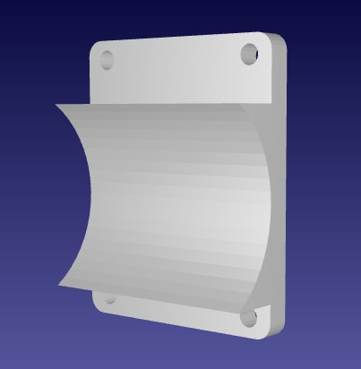 | Sujeción principal de la plancha al efector del UR3 |
| Agarre de Plancha 2 | 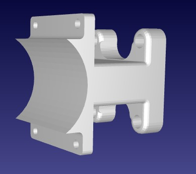 | Pieza complementaria del agarre de plancha |
| Agarre Motor a Pasos | 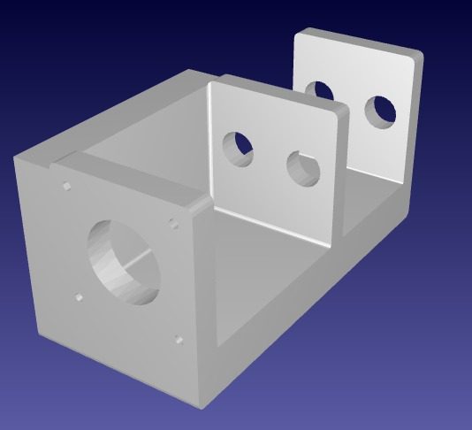 | Montaje del motor Nema 17 en la estructura |
| Gancho | 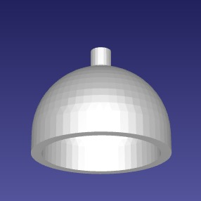 | Gancho de salida para entrega de prenda |
| Cadena Ganchito |  | Eslabón de cadena para sistema de transporte |
| Carrito Base | 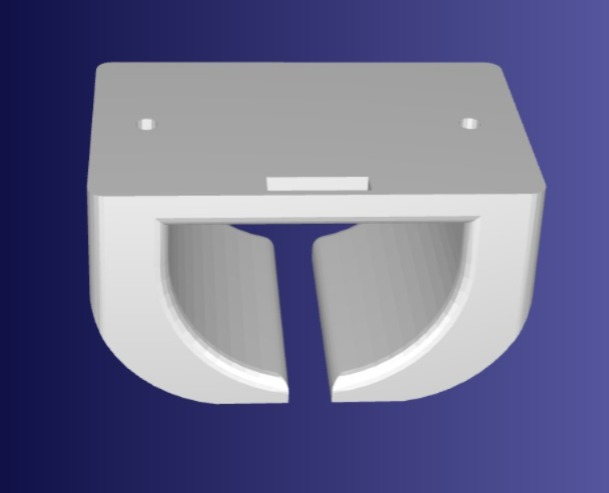 | Base del carrito sobre la banda |
| Carrito Agarre | 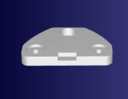 | Agarre superior del carrito |
| Engranaje Plato | 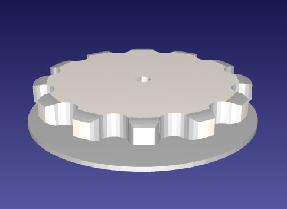 | Engranaje de transmisión principal |
| Engranaje Final | 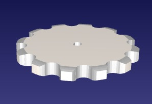 | Engranaje de salida del sistema |
| Soporte Tensor | 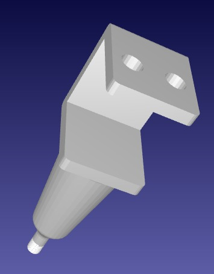 | Soporte para sistema de tensado de banda |
| Tuerca Tensor | 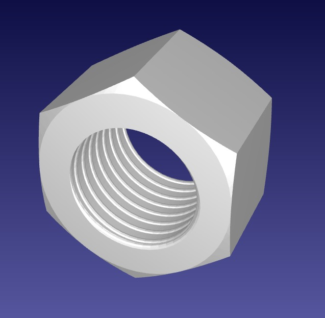 | Elemento de ajuste del tensor |
| Tensores | 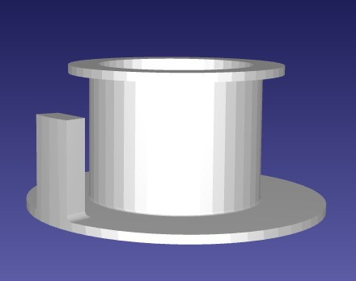 | Componentes de tensado de la banda |
| Sensores | 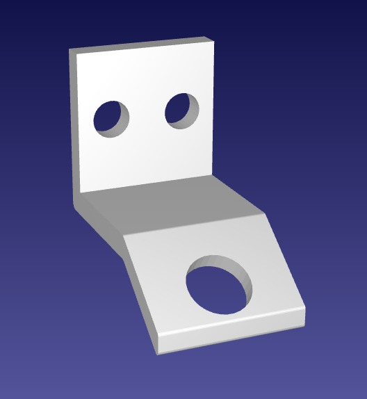 | Soporte/montaje para sensores inductivos |
| Soporte acetato sup. | 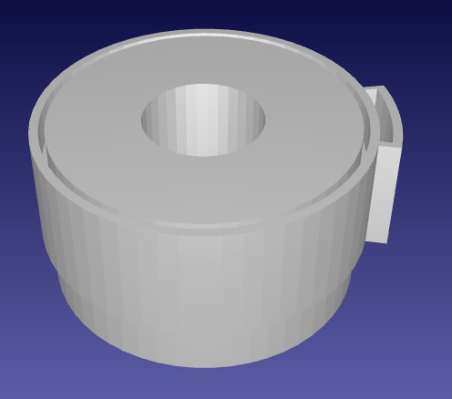 | Soporte superior lateral de acetato |
| Soporte acetato | 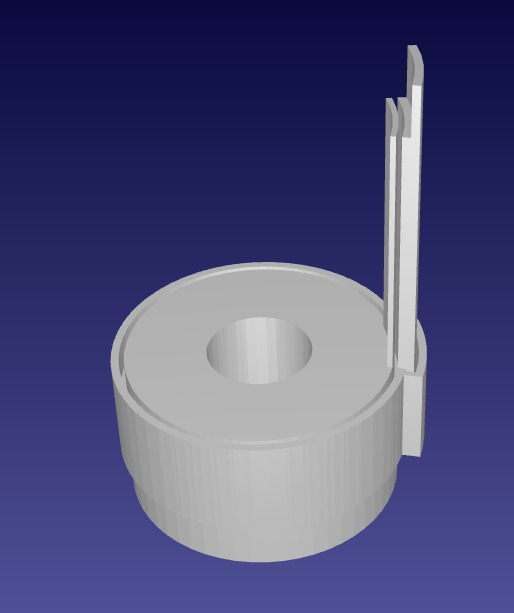 | Soporte lateral de acetato |

---

## Siguiente sección

[Diseño Electrónico](08-diseno-electronico.md)