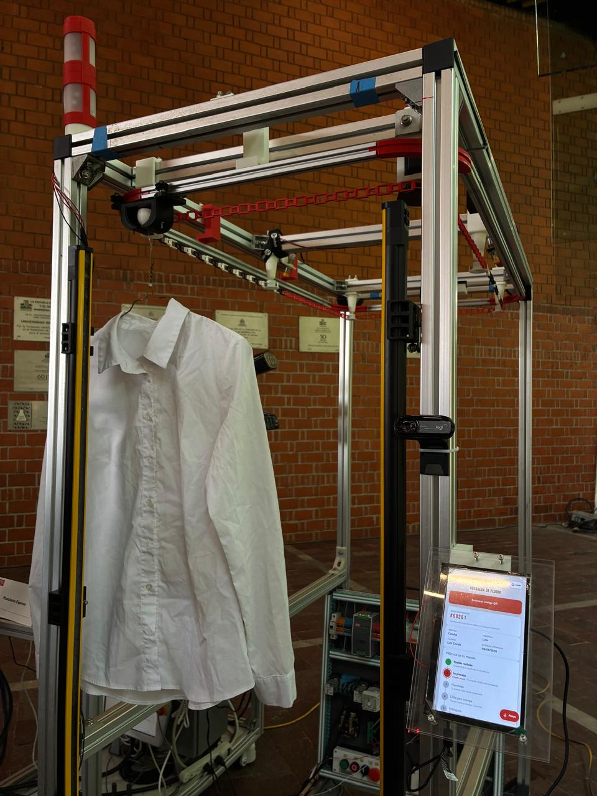
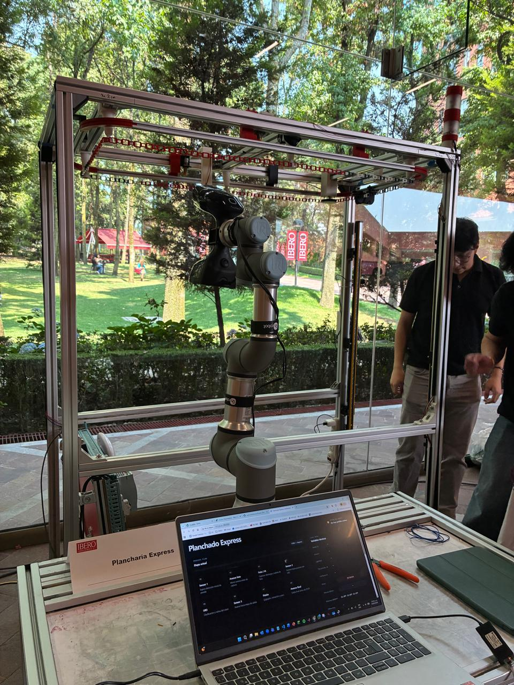
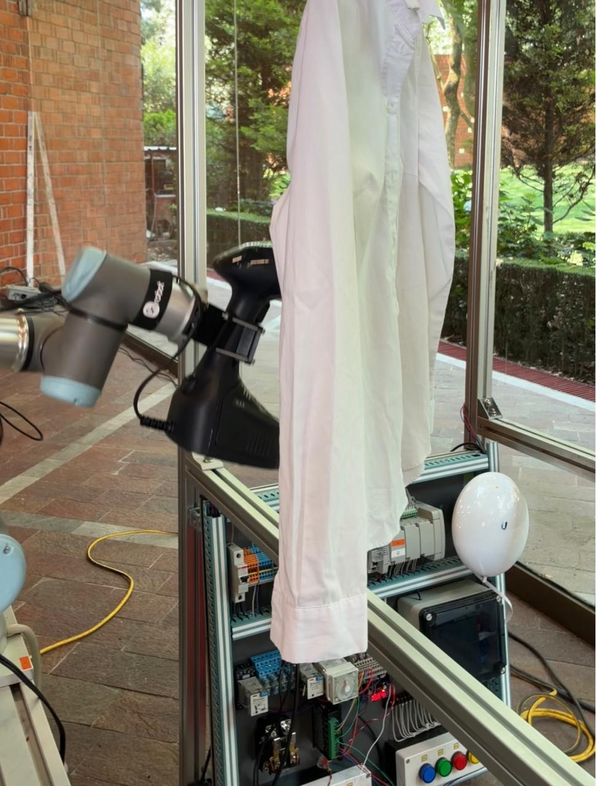
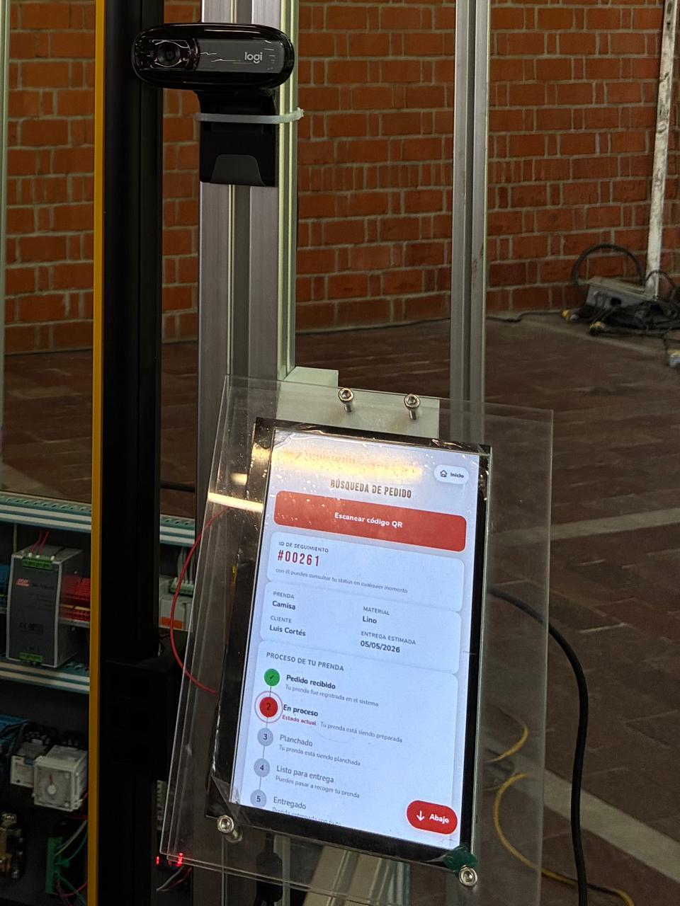
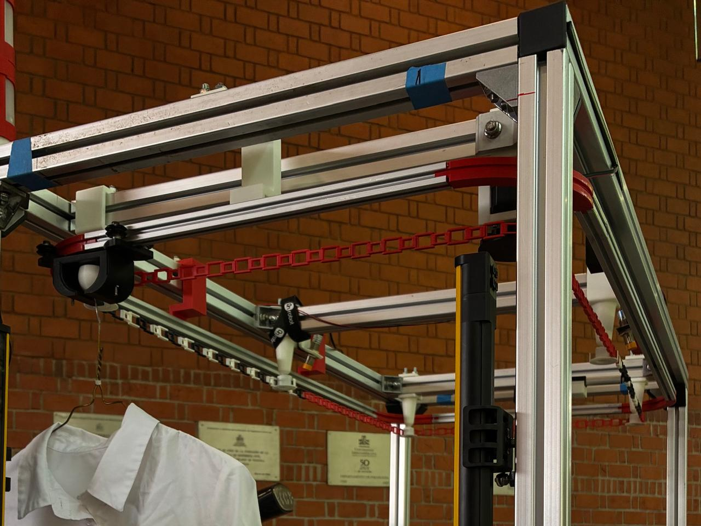
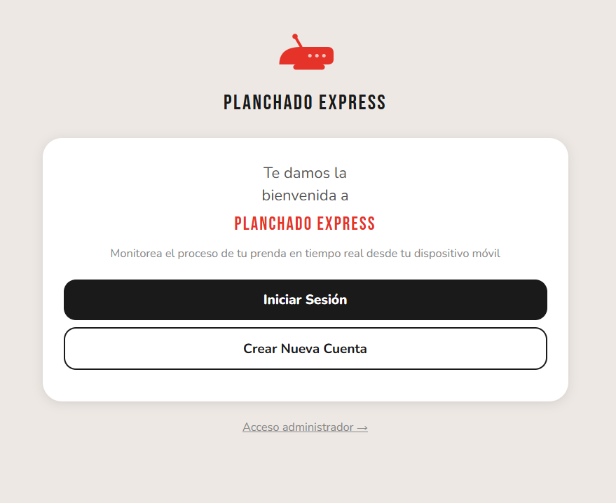

# Evidencia Visual

## Fotografías del sistema

{: .note }
Fotografías del sistema físico. Coloca tus imágenes en la carpeta `assets/img/evidencia/` y reemplaza los nombres de archivo en los ejemplos de abajo.

### Sistema completo — Vista general

### Robot UR3 con efector y plancha

### Tablero PLC Micro850

### HMI con lector QR

### Banda transportadora y sensores

---

## Interfaz web — Capturas de pantalla

La interfaz web está disponible en vivo en:

[luiscortesmunoz.github.io/Planchaduria](https://luiscortesmunoz.github.io/Planchaduria/){: .btn .btn-red }

### Pantalla principal — Inicio de sesión

### Registro de prenda y generación de QR

### Video Funcionamiento
<video controls width="720">
  <source src="{{ '/assets/img/pagina.mp4' | relative_url }}" type="video/mp4">
  Tu navegador no soporta el formato de video.
</video>
---

## Prendas procesadas — Evidencia fotográfica IA

Las siguientes fotografías fueron capturadas automáticamente durante las pruebas del 27–28 de abril de 2026 y almacenadas en [Firebase Storage](assets/files/fotos_pc):

| Archivo | Usuario | Fecha | Clasificación IA |
| :--- | :--- | :--- | :--- |
| `usuario_229_foto_1_20260427_172033.jpg` | 229 | 27 Abr · 17:20 | — |
| `usuario_230_foto_1_20260427_190505.jpg` | 230 | 27 Abr · 19:05 | — |
| `usuario_231_foto_1_20260427_191223.jpg` | 231 | 27 Abr · 19:12 | — |
| `usuario_233_foto_1_20260427_203505.jpg` | 233 | 27 Abr · 20:35 | — |
| `usuario_234_foto_1_20260427_203911.jpg` | 234 | 27 Abr · 20:39 | — |
| `usuario_235_foto_1_20260427_204239.jpg` | 235 | 27 Abr · 20:42 | — |
| `usuario_236_foto_1_20260427_205636.jpg` | 236 | 27 Abr · 20:56 | — |
| `usuario_237_foto_1_20260427_211726.jpg` | 237 | 28 Abr · 21:17 | — |
| `usuario_238_foto_1_20260427_212537.jpg` | 238 | 28 Abr · 21:25 | — |
| `usuario_239_foto_1_20260427_213958.jpg` | 239 | 28 Abr · 21:39 | — |

---

## Video de demostración

<video controls width="720">
  <source src="{{ '/assets/img/videofinal.mp4' | relative_url }}" type="video/mp4">
  Tu navegador no soporta el formato de video.
</video>

---

## Siguiente sección

[Referencias](17-referencias.md)
